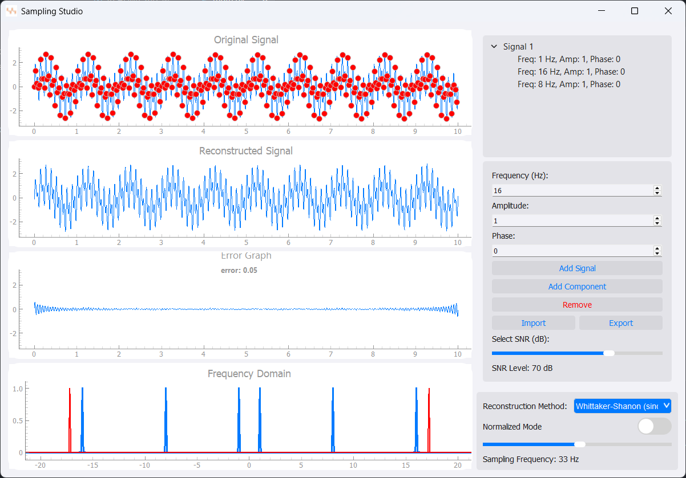

# NyquistLab: Interactive Signal Sampling & Reconstruction  

## 📌 Overview  
NyquistLab is a **real-time interactive desktop application** that demonstrates the **Nyquist-Shannon sampling theorem**. It allows users to visualize signal sampling, apply different reconstruction methods, and analyze aliasing effects in both time and frequency domains.  

## 🎯 Features  
- **Real-time Sampling & Recovery** – Visualize sampled signals and reconstruct them using multiple methods.  
- **Custom Signal Mixer** – Create composite signals with different frequencies and magnitudes.  
- **Noise Control** – Add adjustable noise and observe its impact on signal reconstruction.  
- **Frequency Domain Analysis** – Inspect aliasing and reconstruction errors with FFT visualization.  
- **Multiple Reconstruction Methods** – Compare Whittaker-Shannon interpolation with other techniques.  
- **Resizable UI** – Ensures smooth user experience without layout issues.  

## 🖥️ Screenshots  
### Main Interface

## 🛠️ Installation  
1. Clone the repository:  
   ```sh
   git clone https://github.com/Kirellos-Safwat/NyquistLab.git
   cd NyquistLab
   ```  
2. Install dependencies:  
   ```sh
   pip install -r requirements.txt
   ```  
3. Run the application:  
   ```sh
   python main.py
   ```  

## 📜 Usage  
- Load a signal from a file or create one using the **Signal Mixer**.  
- Adjust the **sampling rate** and observe the reconstructed signal.  
- Compare different **reconstruction methods** via a dropdown menu.  
- Add **noise** and analyze how it affects signal recovery.  
- Explore aliasing in the **frequency domain visualization**.  

## 🚀 Future Enhancements  
- Support for additional interpolation methods.  
- More real-world signal examples for analysis.  
- GUI improvements for better user experience.  
 